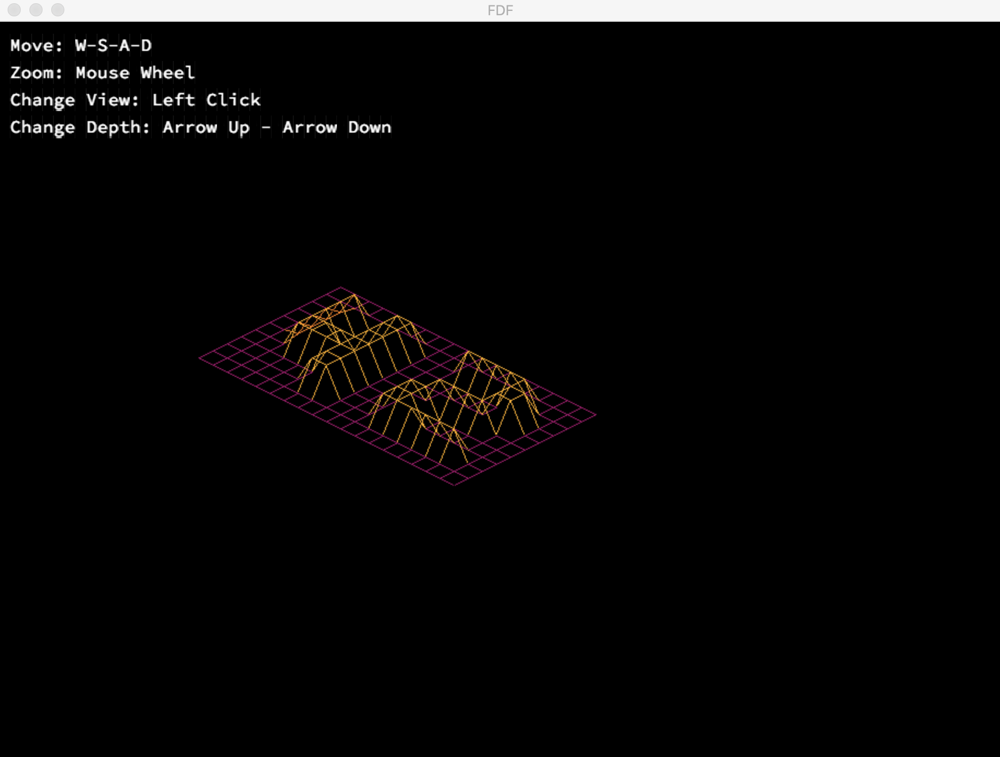

FdF - 42 Curriculum Project
Introduction

FdF (Fil de Fer) is a graphical project in the 42 curriculum designed to introduce students to the fundamentals of 3D graphics programming. Developed as part of the 42 education program, this project challenges students to create a wireframe 3D representation of a landscape defined by heightmaps. FdF serves as a stepping stone for aspiring programmers to delve into the fascinating world of computer graphics.
Project Overview

In FdF, you will have the opportunity to explore the principles of computer graphics and gain hands-on experience with essential concepts such as coordinate transformations, 3D rendering, and color mapping. The project's primary goal is to visualize a grid-based landscape by connecting the data points with lines to create a 3D terrain representation.
Key Features

    Parsing: FdF begins with parsing a text file containing heightmap data. Each number in the file represents the elevation at a specific point on the grid.

    Projection: The project offers the flexibility to switch between different 3D projections, allowing you to view the terrain from various angles and perspectives.

    Wireframe Rendering: FdF renders the landscape as a wireframe mesh, connecting adjacent points with lines to form the 3D terrain.

    Color Mapping: Elevations are mapped to colors, creating a visually appealing representation of the landscape. Lower elevations may be blue, while higher elevations can be red, for example.

    User Interaction: You can navigate through the terrain, zoom in/out, and rotate it to explore different parts of the landscape.

    Bonus Features: FdF encourages creativity by offering bonus features, such as gradient coloring and smoothing algorithms, to enhance the visual quality of the terrain.

Getting Started

To begin working on FdF, follow these steps:

    Clone the repository to your local machine: git clone https://github.com/yourusername/FdF.git

    Navigate to the project directory: cd FdF

    Compile the project: make

    Run the program with a heightmap file: ./fdf [filename]

    Explore the 3D landscape and experiment with the available features.

Learning Objectives

FdF is designed to teach you the following concepts:

    Parsing and data manipulation
    3D graphics projections
    Drawing and rendering in a 2D window
    Color mapping and gradient creation
    User interaction and controls
    Problem-solving and algorithmic thinking

